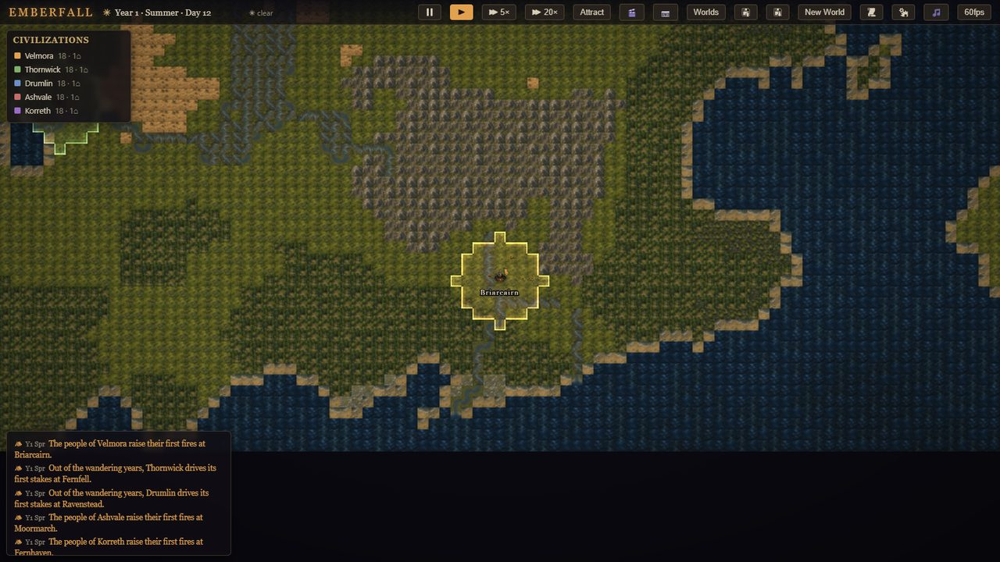
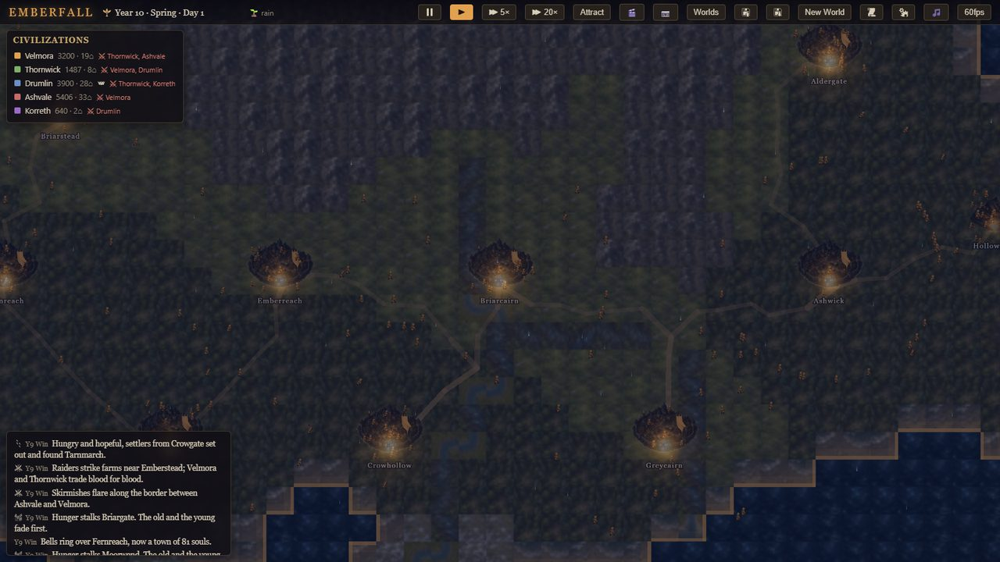
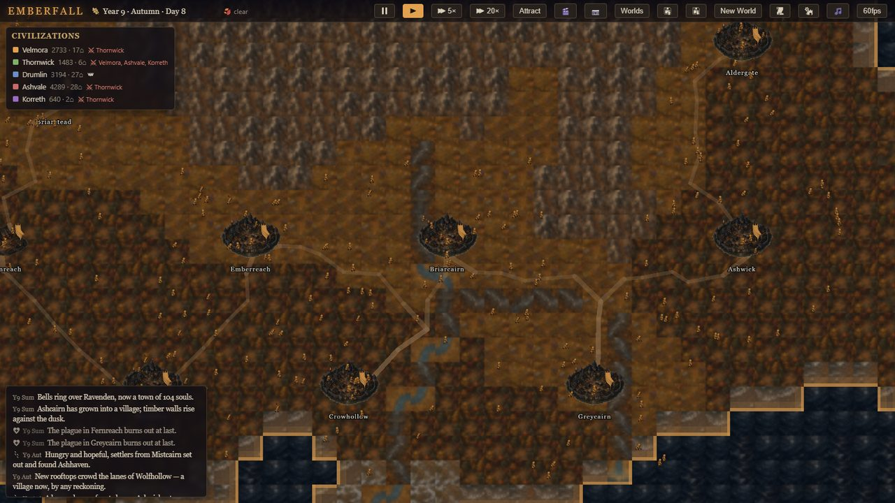
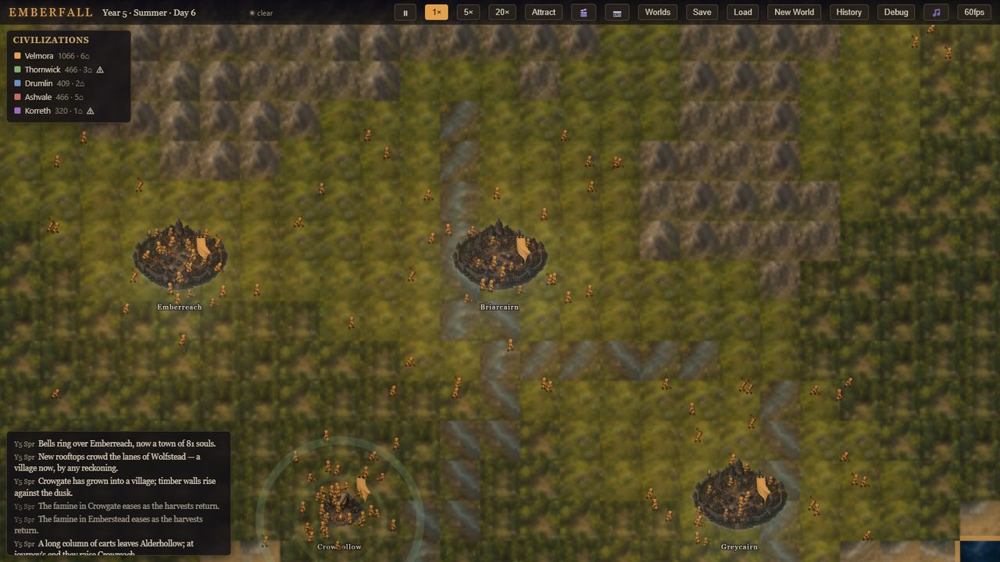

# Emberfall

An idle civilization ecosystem simulation — a living world in a bottle. Tiny
civilizations rise from first campfires, grow into glowing towns, trade,
quarrel, fall to plague and war, and rebuild — while you watch, like an
aquarium of history on a second monitor.

Cozy but slightly dark fantasy: soft seasons, drifting weather, small lights
against the night.



## Features

- **A seed-deterministic world**: 160×100 tiles, 9 biomes, rivers with bends
  and mouths, elevation/moisture/temperature, four seasons of hand-tinted
  terrain art. Wildfires burn and spring regrows.
- **Five civilizations** (more can rise from ruins): population, seven
  resources, culture traits, settlements that grow camp → village → town,
  and a full relation matrix — trade, alliances, rivalries, wars with border
  skirmishes and captures.
- **Peace treaties & tribute**: losing sides sue for peace; tribute caravans
  flow seat to seat under a truce that lets the defeated rebuild. Empires
  are the exception, not the rule.
- **Emergent events, chronicled in prose**: famine, plague (with spread and
  immunity), migration, succession crises, schisms, wildfire, flood, golden
  ages, collapse — every one written into a storybook chronicle with its own
  icon, place and date.
- **Civ rebirth**: fallen cultures leave ruins on the map; new peoples
  kindle their fires among the old stones and inherit a trait.
- **Roads & caravans**: trade routes carve visible roads (A* over terrain,
  fords and passes); trading citizens follow them.
- **A living close-up**: zoom in and individual citizens farm, build, trade,
  flee and rest through day and night; zoom out for a glowing
  city-lights map.
- **Showcase layer**: attract-mode auto-director, cinematic camera, world
  story overlay, curated seed gallery, adaptive seasonal/mood music.
- **Deterministic to the bit**: one seeded RNG stream; save → load → run
  reproduces identical history (test-proven, including a 100-year stress
  run).

| | |
| --- | --- |
|  |  |
| *Night reads as a map of small lights.* | *Trade carves roads between towns.* |



## Setup

Requires Node 18+.

```bash
npm install
npm run dev      # start the dev server, open the printed URL
npm run build    # typecheck + production build into dist/
npm test         # run the Vitest suite
npm run typecheck
```

Optional: open a specific world with `?seed=12345` in the URL.

## Controls

| Input | Action |
| --- | --- |
| Drag (left mouse) | Pan the camera |
| Mouse wheel | Zoom toward the cursor |
| Click | Inspect tile / settlement / citizen (citizens win ties) |
| `Space` | Pause / resume |
| `1` / `2` / `3` | 1× / 5× / 20× speed |
| `A` | Attract mode (automated cinematic tour; any input exits) |
| `C` | Cinema mode (hide all UI) |
| `P` | Screenshot (PNG of the canvas) |
| `G` | Seed gallery |
| `W` | World Story overlay |
| `H` | Toggle the History panel |
| `M` | Toggle music |
| `F3` | Toggle the debug overlay |
| `Esc` | Close panels |
| Top bar | Save / Load (localStorage), New World, FPS cap, panel toggles |

Zoom in past ~1.4× to see individual citizens going about their day. At night
they head home; villages glow.

## Architecture

Simulation and rendering are strictly separated: `src/sim` is plain data +
pure-ish systems with **no Pixi imports**, ticked in whole-day steps from a
single seeded RNG stream (`core/rng.ts`). Rendering reads state and never
writes it.

```
src/
├── config/        ALL balance constants (balance.ts), terrain defs, civ flavor
├── core/          types.ts (every shared data shape), rng.ts (seeded PRNG + hash)
├── world/         worldgen.ts (fBm noise, biomes, rivers), world.ts (tile helpers)
├── sim/
│   ├── simulation.ts   orchestrator: fixed day-tick order, system timings
│   ├── time.ts         days → seasons → years calendar
│   ├── resources.ts    settlement production/consumption, civ accrual
│   ├── growth.ts       population dynamics, camp→village→town upgrades
│   ├── diplomacy.ts    relation scores → neutral/trade/alliance/rivalry/war
│   ├── treaties.ts     peace treaties: truces and tribute when a war is lost
│   ├── territory.ts    tile ownership + border detection
│   ├── events.ts       famine, plague, migration, war, schism, wildfire, flood…
│   ├── chronicle.ts    storybook text composition + the event log
│   ├── founding.ts     civ/settlement creation, site scoring
│   ├── rebirth.ts      fallen civs return: new cultures rise from quiet ruins
│   ├── roads.ts        road network: per-civ spanning tree + A* trade routes
│   ├── agents.ts       hybrid LOD: visible citizen agents near the camera
│   └── weather.ts      cosmetic daily weather (pure hash of seed+day)
├── render/        Pixi: camera (with cinematic flights), terrain bake,
│                  territory, roads, settlements, citizens, event markers,
│                  atmosphere (night/dusk/particles), textures
├── showcase/      interest.ts (shot scoring), director.ts (attract-mode
│                  cinematographer), stress.ts (determinism/perf harness)
├── audio/         music.ts — seasonal base + night layer + chronicle moods
├── ui/            DOM panels: HUD, civ roster, inspector, chronicle,
│                  history, world story, seed gallery, debug overlay;
│                  icons.ts maps event kinds to tintable SVG glyphs
└── persist/       save.ts — serialize to localStorage (manual + autosave
                   slots); world regenerates from seed, diffs replayed
```

### Key design decisions

- **Determinism.** One RNG stream drives the simulation; its 32-bit state is
  saved and restored, so a save → load → run produces bit-identical history.
  Cosmetic systems (agents, weather, render jitter) use separate streams or
  stateless hashing and can never perturb the simulation.
- **Hybrid simulation.** Aggregate settlement simulation is authoritative
  everywhere. Settlements near the camera materialize individual citizen
  agents (capped, budgeted) that gather, build, farm, trade, flee, rest and
  fight — pure detail expansion, no write-back.
- **Cheap rendering.** The whole terrain is baked into one RenderTexture per
  season (rebuilt only when terrain actually changes, e.g. wildfire). The
  night overlay, glows and weather are a handful of screen-space layers.
- **Data-oriented.** State is plain serializable data (`SimState`); systems
  are functions over it. No inheritance hierarchies.

## Extension guide

- **Tune the world**: everything lives in `src/config/balance.ts` — growth
  rates, event chances, diplomacy thresholds, agent counts. Terrain colors
  and yields are in `src/config/terrainConfig.ts`.
- **Add an event**: write a `maybeX(state, rng)` function in `sim/events.ts`,
  call it from `generateDailyEvents`, add text templates in
  `sim/chronicle.ts`, and constants in `balance.ts`. Done — it is now
  deterministic, chronicled, and visible in the History panel.
- **Add a culture trait**: extend `CULTURE_TRAITS` + `TRAIT_EFFECTS` in
  `config/civConfig.ts`, then consume the effect in the relevant system.
- **Add a settlement tier**: extend the tier arrays in `balance.ts`, add a
  texture in `render/textures.ts`, extend `growth.ts` upgrade rules.
- **Real art**: see `ASSET_MANIFEST.md` for the full asset list and
  `GPT_IMAGE_PROMPTS.md` for generation prompts; swap textures in
  `render/textures.ts` for `Assets.load(...)` calls.
- **New agent behaviors**: add a state in `sim/agents.ts#chooseTask` and a
  matching animation rule in `render/citizenLayer.ts`.

## Showcase Mode

Emberfall is built to be left running on a second monitor.

**Attract mode** (`A`, or open with `?attract=1`): an automated director tours
the world — cutting to wars, captures, wildfires, migrations and golden ages
as they happen, lingering on capitals and frontiers in between, with slow
drifting shots and eased flights. All UI hides except the **World Story**
overlay (year, season, dominant civilization, active crises, latest chronicle
line). Touching the mouse or keyboard hands control back to you.

**Best seeds** (from the curated gallery, `G`): seed `79` *The Braided
Waters* (river country, contested borders), seed `34` *The Stonecrown
Reaches* (mountain realm, dense towns), seed `3` *The Sundered Isles*
(island wars), seed `89` *The Deepwood Realm* (slow forest world). Open any
world directly with `?seed=79`.

**Recording a demo clip:**

1. Open the world you want (`?seed=48&attract=1` is a good start).
2. Set speed to 1× or 5× — 20× is great for time-lapses.
3. Press `A` for the cinematic tour (or `C` to just hide UI and drive the
   camera yourself; `P` saves clean PNG stills).
4. Capture the browser window with OBS or any screen recorder; the canvas is
   plain WebGL, so window capture works without tricks.
5. Night scenes (glowing settlements under snowfall) read best on video —
   wait for winter.

**Reliability:** the game autosaves every 3 minutes to a separate slot (Load
picks the newest of manual/auto), the frame rate is capped at 60fps by
default (cycle with the fps button), and `?stress=1` runs a 100-year
double-simulation on boot, reporting wall time and a bit-identical
determinism check in the debug overlay.

## Testing

`npm test` covers terrain generation determinism and biome coverage, resource
production/consumption, settlement growth and tier upgrades, diplomacy
threshold transitions (war declaration, war exhaustion → peace), peace
treaties (surrender terms, truces, tribute flow), event triggers
(famine/plague/collapse), road network building, civ rebirth, attract-mode
shot scoring, full-state save/load round-trips, post-load determinism, and a
100-year stress run.

Two extra dev tools live in `scripts/`:

- `npx vite-node scripts/longrun.ts` — simulate 10 in-game years headless and
  print population, settlement tiers and a histogram of chronicle events
  (useful when tuning `balance.ts`).
- `npx vite-node scripts/curate-seeds.ts` — re-score candidate seeds and
  regenerate the seed gallery (`src/config/seedGallery.ts`).
- `node scripts/smoke.mjs` — drive the running dev server with a headless
  Chromium/Edge, screenshot the game and dump console errors (requires a
  local Edge/Chrome; adjust the executable path at the top).

## Credits

- UI and event icons from [game-icons.net](https://game-icons.net)
  ([CC BY 3.0](https://creativecommons.org/licenses/by/3.0/)) by Lorc,
  Delapouite, Skoll, Zeromancer and Guard13007 — full list in
  [`public/assets/icons/ATTRIBUTION.md`](public/assets/icons/ATTRIBUTION.md).
- Terrain, settlement and citizen art generated with GPT-Image; music
  generated with Suno (see `ASSET_MANIFEST.md`).
